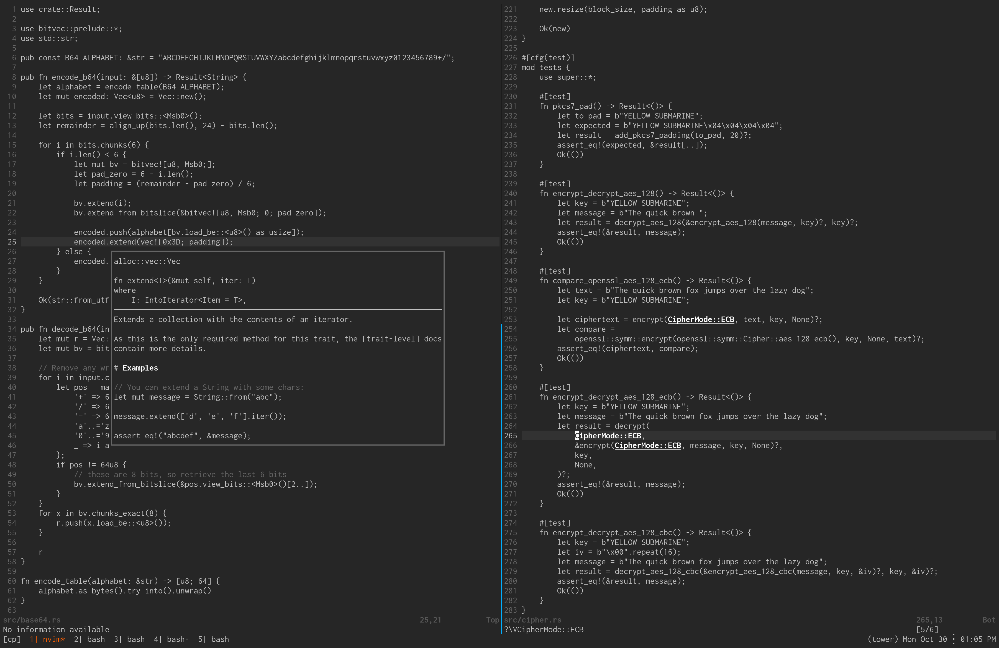

## vim-ascetic

I wanted a monochrome dark (n)vim colorscheme that used a transparent
background with softer tones. Too many of them used bolds and bright whites
excessively. Apparently that's not a thing, so I made this.



### Options

- **Transparent background** is enabled by default, you can turn this off with:
```vim
colorscheme ascetic
let g:ascetic_transparent_bg = 0
```

- **Accent colors** are enabled by default. These are used for matching
parenthesis, Git gutter signs, some errors and warnings. Turn this off with:
```vim
colorscheme ascetic
let g:ascetic_accent_colors = 0
```
