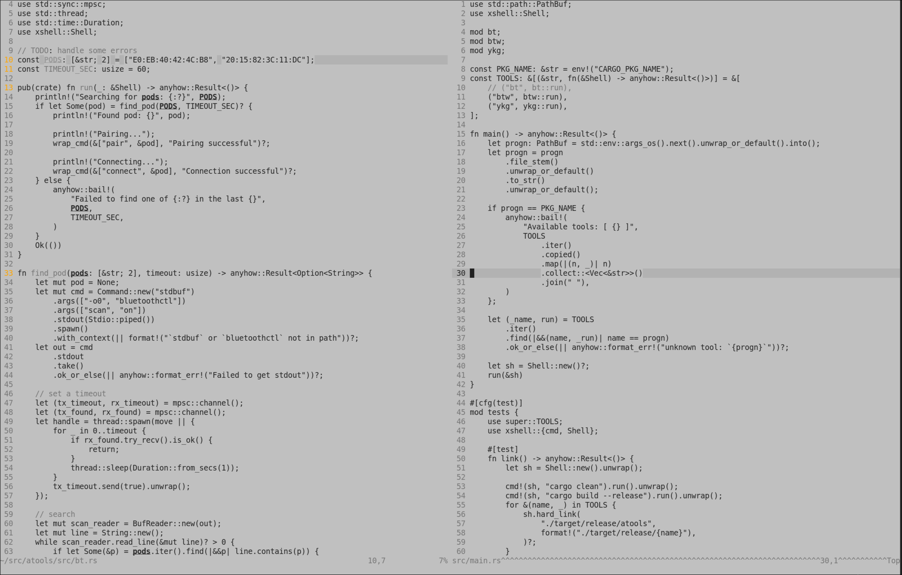

## vim-ascetic

I wanted a monochrome (n)vim colorscheme that used a transparent
background with softer tones. Too many of them used bolds and bright whites
excessively. Apparently that's not a thing, so I made this.

### Usage

This colorscheme supports a light background. Set your background accordingly
prior to declaring the colorscheme:

```vim
set background=dark " or light

colorscheme ascetic
```
> Note: The background will default to transparent, this can make the colorscheme not work if your default background is dark, but you set the colorscheme to light without setting `g:ascetic_transparent_bg=0`.

### Dark background


### Light background


### Options

- **Transparent background** is enabled by default, you can turn this off with:
```vim
let g:ascetic_transparent_bg = 0
```

- **Accent colors** are enabled by default. These are used for matching
parenthesis, diffs, errors, and warnings. Turn this off with:
```vim
let g:ascetic_accent_colors = 0
```

- **String highlighting** is disabled by default, you can turn this on with:
```vim
let g:ascetic_highlight_strings = 1
```
